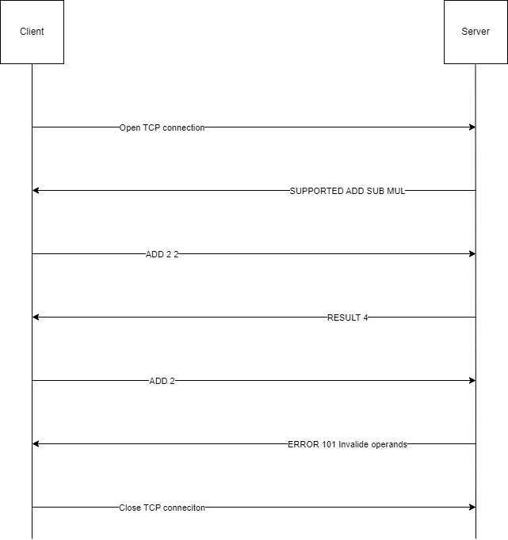

# Protocol specification
## Overview
Math protocol is a client-server protocol. The client connects to the server, sends simple calculation to do. Ex : ADD 2 2. The server sends the result or an error message if the calculation is not possible (format or other).

## Transport layer protocol
Math protocol uses TCP. The client establishes the connection. It has to know the IP address of the server. The server listens on TCP port 55555.
The client closes the connection when the user want to quit.

## Messages
There are two types of messages:
```
<operation> <operand1> <operand2>
```
The client sends a string with the operation to do and the two operands. The server sends the result of the operation.
```
ERROR <errorcode> <errormessage>
```
Error response message after an operation message, if the format isn't valid (missing or invalid operand) or not supported operation.

Both messages are UTF-8 encoded with “\n” as end-of-line character.

## Example dialogs
### Hello message
```
Server: SUPPORTED ADD SUB MUL
```

### Operation message
```
Client: ADD 2 2
Server: RESULT 4
```

### Error message
```
Client: ADD 2
Server: ERROR 101 Invalid operands
```

## Specific elements
### Supported operations
- ADD: Adds two numbers.
- SUB: Subtracts the second number from the first.
- MUL: Multiplies two numbers.

### Data types
- Numerical values: Accepts both integers and floating-point numbers in decimal notation without commas or spaces.

### Error handling
- Invalid operands (ERROR 101): Operands are missing or not valid numbers.
- Unknown operation (ERROR 102): Operation not supported.
- Malformed command (ERROR 103): Command does not follow the specified format.

### Security considerations
- Authentication: Not included in the protocol.
- Encryption: Data is transmitted in plain text. For security, use SSL/TLS wrapping.

## Implementation notes
- Extensibility: Future operations can be added. Clients should handle unknown operations gracefully.
- Timeout: Clients should implement timeouts and attempt reconnection if the server is unresponsive.
- Input validation: Both client and server should validate inputs to prevent errors and security issues.
- Case sensitivity: Commands must be in uppercase. Lowercase inputs should result in an error.

## Examples dialogs
